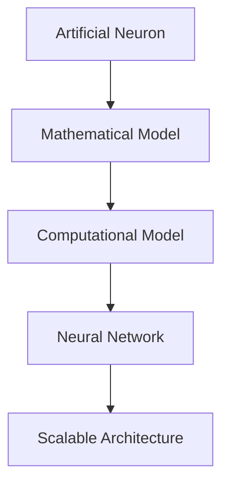
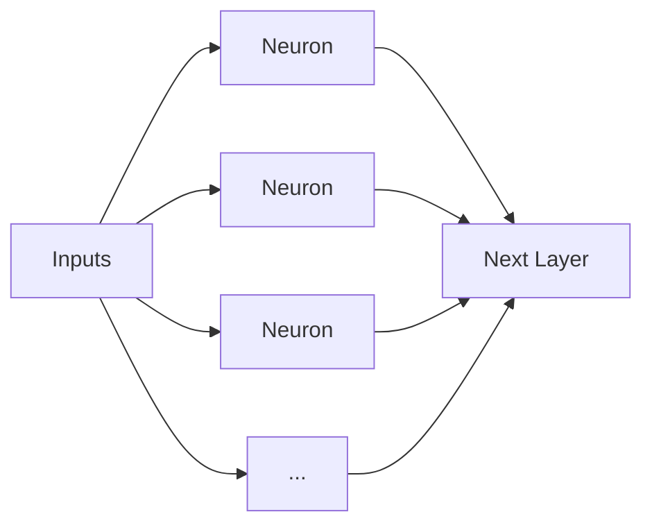
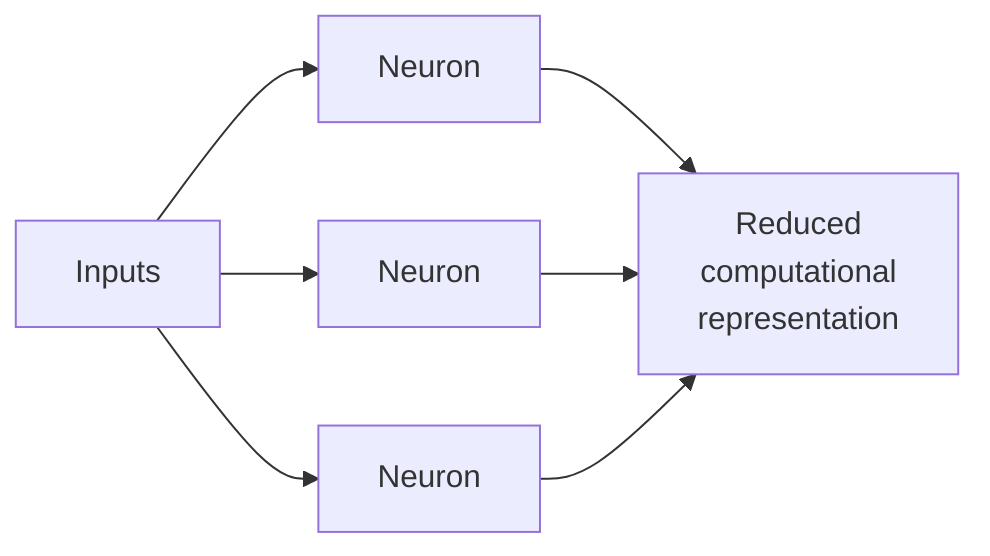
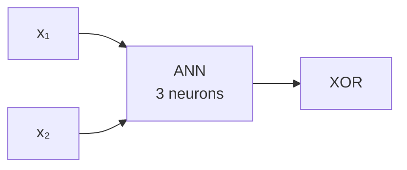
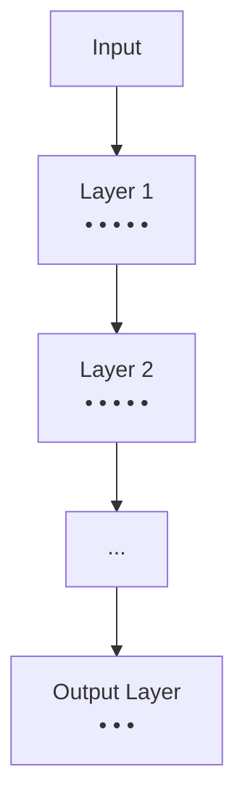
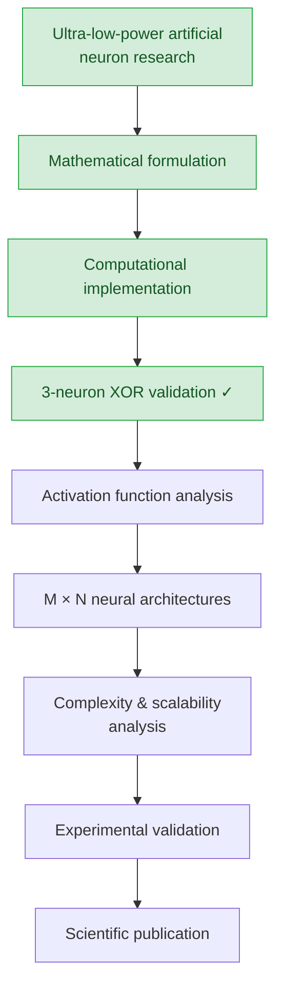
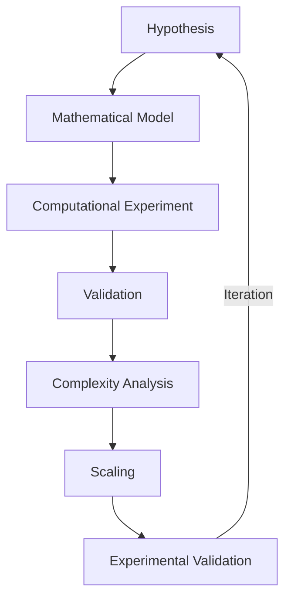

# Neuromorphic Computing Research

<p align="center">
  <strong>Exploring alternative approaches to efficient neural computation</strong>
</p>

<p align="center">
  From ultra-low-power artificial neurons to scalable neural architectures.
</p>

<p align="center">
  <a href="#current-status">Status</a> •
  <a href="#research-hypothesis">Hypothesis</a> •
  <a href="#experimental-validation">Validation</a> •
  <a href="#research-roadmap">Roadmap</a> •
  <a href="#research-scope--intellectual-property">Scope & IP</a>
</p>

---

## Abstract

This research explores an alternative approach to neural computation, motivated by a fundamental question:

> **Can useful neural computation be achieved with substantially lower computational complexity than conventional neural architectures?**

The work originated from the design and study of an ultra-low-power artificial neuron and has evolved into an ongoing investigation of the mathematical and computational principles behind efficient neural networks.

The current research combines mathematical modeling, electronic systems, and software-based experimentation to study how the proposed computational model behaves as neural architectures scale.

A first major milestone has already been achieved: a custom three-neuron neural network successfully solves the **XOR classification problem**, providing an initial computational validation of the proposed approach.

The long-term objective is not to optimize a particular hardware platform, but to investigate whether the underlying computational model can provide a more efficient foundation for neural computation in general.

---

## Research Origin

This work originates from previous research in **ultra-low-power neuromorphic electronics**.

During undergraduate research, an artificial neuron architecture was investigated with a strong emphasis on reducing energy consumption while preserving useful computational behavior.

That work raised a broader question:

> Can the principles behind an efficient artificial neuron be extended beyond a single device?

This question motivated the following progression:



The current project therefore represents an evolution of the original research rather than an isolated software experiment.

---

## Research Hypothesis

Conventional neural networks rely on large numbers of learned parameters and repeated arithmetic operations.

The proposed model investigates whether neural computation can instead be represented using a reduced computational structure, while preserving the ability to learn and represent useful functions.

The central hypothesis is that **reducing the computational complexity of the underlying neural model may enable substantial reductions in the resources required to execute larger neural architectures.**

This hypothesis is currently being investigated mathematically and experimentally.

---

## The Core Idea

At a high level, the research investigates the computational cost associated with connecting neurons across layers.

**Conventional approach**



Large networks can require a large number of parameters and repeated arithmetic operations as the number of connections increases.

**Proposed approach**



The research investigates whether the same type of neural behavior can be represented with a substantially smaller computational structure.

> The mathematical formulation underlying the proposed model is intentionally not disclosed in this public repository while the research is being prepared for publication.

---

## Theoretical Optimization

The current theoretical analysis evaluates the computational requirements of the proposed model against a conventional neural architecture.

The analysis considers several dimensions:

| Metric | Conventional Model | Proposed Model |
|---|---|---|
| Trainable parameters | High | Reduced |
| Multiplications | High | Reduced |
| Additions | Comparable | Comparable |
| Memory requirements | Higher | Reduced |
| Scalability | Connection-dependent | Under investigation |

The current analysis indicates that the proposed representation can theoretically produce substantial reductions in the number of parameters and multiplications required by a neural architecture.

> These values are theoretical estimates derived from the mathematical model, not measured hardware performance. They should be interpreted as **predicted computational savings that require further mathematical and experimental validation.**

The purpose of this research is precisely to determine whether these theoretical advantages remain valid as the architecture becomes larger and more complex.

---

## Experimental Validation

The research has progressed beyond theoretical modeling.

A neural network implementation developed from first principles has successfully learned the XOR function using three neurons.



**XOR Truth Table**

| Input A | Input B | Expected |
|:---:|:---:|:---:|
| 0 | 0 | 0 |
| 0 | 1 | 1 |
| 1 | 0 | 1 |
| 1 | 1 | 0 |

Successfully solving XOR represents the current proof-of-concept milestone of the computational model.

The next stage is to determine how the model behaves when the number of neurons and layers increases.

---

## From One Neuron to M × N Architectures

The current implementation is being generalized from a small network toward configurable architectures.



The research is currently investigating:

- Activation functions
- Neural representation
- Multi-layer architectures
- Scaling behavior
- Computational complexity
- Parameter requirements
- Mathematical stability
- Generalization beyond XOR

The objective is to determine whether the observed behavior at small scale can be generalized to larger neural systems.

---

## Research Roadmap



---

## Why This Research Matters

The motivation is broader than optimizing a particular embedded implementation.

If the underlying neural representation can be shown to require fewer computational resources while maintaining useful behavior, the consequences could extend across multiple domains:

- Artificial intelligence
- Neural network architectures
- Neuromorphic computing
- Embedded intelligence
- Edge computing
- IoT systems
- Energy-efficient computing
- Specialized hardware accelerators

> These applications are potential consequences, not the primary research objective.

The fundamental objective is to understand whether neural computation itself can be represented more efficiently.

---

## Research Methodology

The project follows an iterative research methodology:



The methodology combines:

- Mathematical analysis
- Computational experimentation
- Neural network implementation
- Complexity analysis
- Experimental validation
- Scientific documentation

---

## Current Status

**Completed**
- [x] Artificial neuron research
- [x] Mathematical modeling
- [x] Computational implementation
- [x] Three-neuron neural network
- [x] XOR classification

**In Progress**
- [ ] Activation function analysis
- [ ] Generalized M × N architecture
- [ ] Scalability analysis
- [ ] Extended computational experiments
- [ ] Validation of theoretical complexity estimates

**Future**
- [ ] Hardware-oriented validation
- [ ] Broader benchmark evaluation
- [ ] Scientific manuscript
- [ ] Publication

---

## Research Scope & Intellectual Property

This repository is intended to communicate the research direction, motivation, methodology, and selected progress.

The mathematical formulation, implementation details, experimental parameters, and unpublished results that constitute the core of the research are **intentionally not included**.

The purpose of this repository is to provide a transparent overview of the research while preserving the integrity of ongoing scientific work.

---

## Research Status

**Ongoing** — experimental and theoretical validation in progress.

The scientific manuscript associated with this research is currently under preparation.

---

## Author

**Carlos Daniel Perdomo Vela, ENG**

Electronics Engineer
Embedded Systems · Neuromorphic Computing · Embedded AI

---

## Repository Structure

```text
.
├── docs/
│   ├── motivation.md
│   ├── research-direction.md
│   ├── methodology.md
│   ├── roadmap.md
│   └── expected-impact.md
│
├── results/
│   └── README.md
│
├── README.md
├── LICENSE
└── .gitignore
```