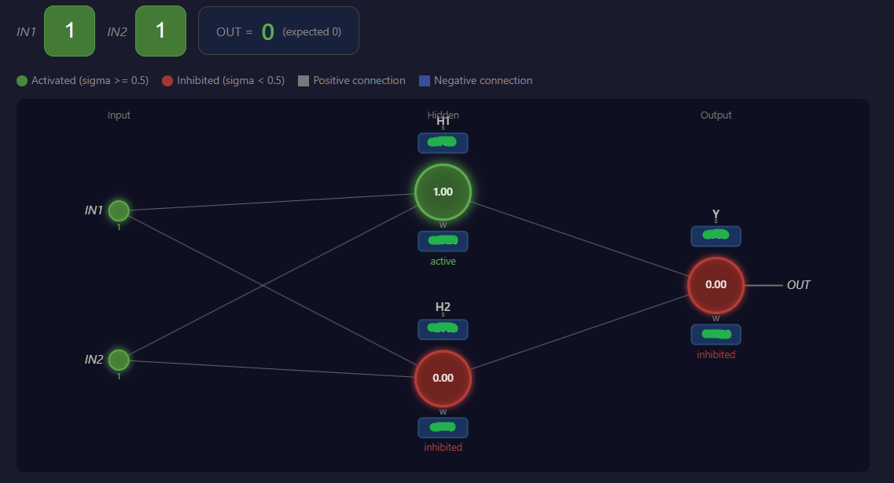
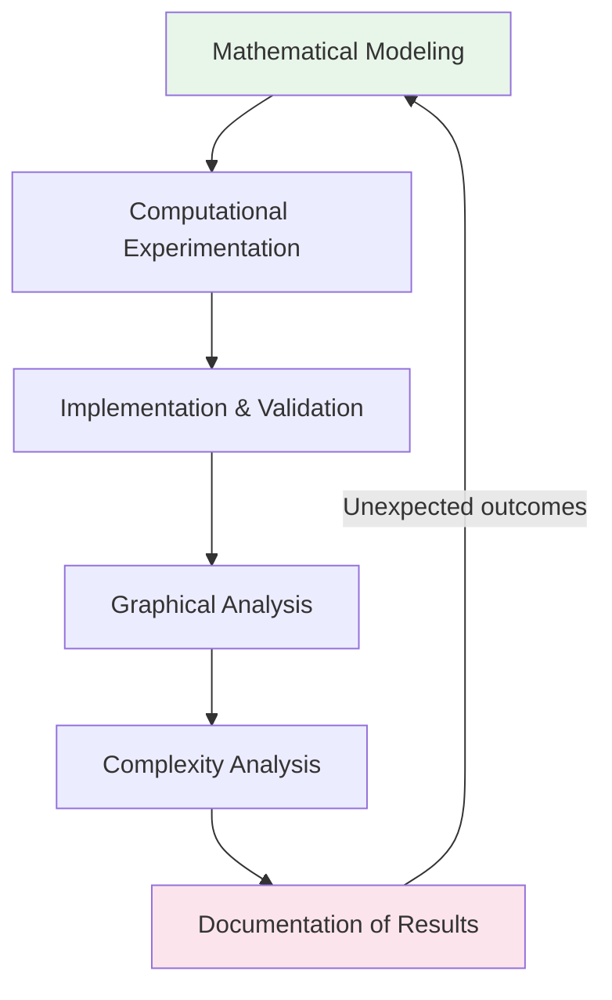

# XOR Classification — Reduced-Parameter Neural Representation

> **Proof-of-Concept Milestone**  
> A minimal three-neuron network successfully solves XOR using a reduced parameterization.  
> *Status: Ongoing experimental and theoretical investigation.*

---

## Table of Contents

1. [Overview](#1-overview)
2. [The XOR Problem](#2-the-xor-problem)
3. [Experimental Architecture](#3-experimental-architecture)
4. [Results](#4-results)
5. [Research Methodology](#5-research-methodology)
6. [Key Finding: Information Preservation](#6-key-finding-information-preservation)
7. [Activation Function Investigation](#7-activation-function-investigation)
8. [Current Research Questions](#8-current-research-questions)
9. [From XOR to M × N Architectures](#9-from-xor-to-m--n-architectures)
10. [Roadmap](#10-roadmap)
11. [Interactive Experiment](#11-interactive-experiment)
12. [Research Perspective](#12-research-perspective)
13. [Intellectual Property & Scope](#13-intellectual-property--scope)

---

## 1. Overview

This repository documents the first computational experiment of an ongoing research project aimed at evaluating whether a **reduced-parameter neural representation** can preserve useful computational behavior.

Rather than treating XOR as the final objective, this experiment serves as a compact, well-defined test case for studying how the proposed neuron model behaves when multiple neurons interact under strict parameter constraints.

**Current milestone:** XOR classification successfully demonstrated with a three-neuron network, associating **one primary weight per neuron**.

---

## 2. The XOR Problem

The XOR (exclusive OR) logical function produces an output of `1` when two binary inputs are different, and `0` when they are equal.

| Input A | Input B | Expected Output |
|:-------:|:-------:|:---------------:|
| 0 | 0 | 0 |
| 0 | 1 | 1 |
| 1 | 0 | 1 |
| 1 | 1 | 0 |

XOR is a canonical example of a non-linearly separable classification problem. Its desired output cannot be represented by a single conventional linear decision boundary, making it an ideal minimal test for determining whether the proposed representation can combine multiple neuron responses to produce a non-trivial decision.

---

## 3. Experimental Architecture

The proof of concept uses a minimal three-neuron network:

### Design Principles

- **Minimal structure:** Intentionally small number of neurons.
- **Reduced parameterization:** One primary weight per neuron.
- **Goal:** Determine how much computational behavior can emerge from minimal structural complexity, rather than maximizing model capacity.

> **Note:** The complete mathematical formulation underlying this model is intentionally not published in this repository while the research is ongoing.

---

## 4. Results

The three-neuron implementation successfully reproduces the XOR truth table.

| Input | Expected | Model Output | Status |
|:-----:|:--------:|:------------:|:------:|
| 00 | 0 | 0 | ✅ Pass |
| 01 | 1 | 1 | ✅ Pass |
| 10 | 1 | 1 | ✅ Pass |
| 11 | 0 | 0 | ✅ Pass |

This represents the **the first computational proof-of-concept milestone of the research program** for the proposed neural representation. The experiment was implemented and evaluated directly from the mathematical representation of the neurons, rather than through a conventional neural-network framework.

---

## 5. Research Methodology

The investigation follows an iterative experimental methodology that combines:

### Core Workflow

1. **Forward-propagation inspection:** Intermediate behavior of neurons is examined at each step, not just the final output.
2. **Information-loss detection:** Identify situations where different input configurations become computationally indistinguishable.
3. **Iterative refinement:** Unexpected results are treated as part of the research process rather than discarded.

---

## 6. Key Finding: Information Preservation

During experimentation, an important limitation was identified in an early parameter configuration in an early parameter configuration:

### The Aggregation Collapse

Different input configurations can produce the **same aggregated activation value** before reaching the output neuron, causing information loss.

| Scenario | Neuron 1 | Neuron 2 | Aggregation |
|----------|----------|----------|-------------|
| Equal inputs | 0.7 | 0.7 | **0.7** |
| Different inputs | 1.2 | 0.2 | **0.7** |

Although the internal neuron responses were different, the aggregation stage produced an identical value. Consequently, the output neuron received insufficient information to distinguish the two cases.

### Implication

> Reducing the number of parameters is **not sufficient by itself**. The representation must also preserve the information required by subsequent neurons to make distinct decisions.

This observation led to a broader research question:

**How does the choice of activation function and aggregation mechanism affect the information preserved between layers under a reduced parameterization?**

---

## 7. Activation Function Investigation

The initial prototype used a **step activation function** to establish basic computational behavior while keeping the mechanism simple.

The investigation has subsequently expanded to:

- Step
- Sigmoid
- ReLU

### Evaluation Criteria

The objective is not simply to identify the function with the highest classification accuracy. Instead, the study considers:

| Criterion | Description |
|-----------|-------------|
| **Representational capacity** | Can the function express the required decision boundaries? |
| **Information preservation** | Does it retain distinguishable signals between layers? |
| **Numerical behavior** | Stability and range of output values |
| **Parameter requirements** | How many parameters are needed for convergence? |
| **Computational complexity** | Cost of evaluation in resource-constrained environments |
| **Scalability** | Behavior as the architecture grows |
| **Suitability** | Compatibility with the proposed reduced-parameter representation |

### Current Hypothesis

> Different activation functions may produce substantially different solution spaces when combined with the reduced parameterization. This remains an experimental question rather than a confirmed theoretical result.

---

## 8. Current Research Questions

The XOR experiment has led to a more general investigation:

> **Can a neural model using substantially fewer parameters preserve useful computational behavior as the number of neurons and layers increases?**

A more specific formulation currently under investigation:

> **Can a reduced-parameter neural architecture achieve useful classification behavior with fewer parameters than conventional neural-network representations, while maintaining sufficient information between layers?**

**The answer has not yet been established.**

---

## 9. From XOR to M × N Architectures

Successfully solving XOR represents the **first validation milestone**. The next stage is to determine whether the observed behavior generalizes beyond a three-neuron network.

### Generalization Targets

### Key Investigation Areas

| Area | Focus |
|------|-------|
| Network dimensions | Number of neurons and layers |
| Parameter count | Scaling of weights vs. capacity |
| Computational operations | Cost per inference |
| Information propagation | Signal preservation across depth |
| Activation functions | Comparative performance at scale |
| Numerical stability | Behavior under reduced precision |
| Generalization | Performance beyond XOR |

---

## 10. Roadmap

### ✅ Completed
- [x] Artificial neuron computational model
- [x] Mathematical representation
- [x] Computational implementation
- [x] Three-neuron architecture
- [x] XOR classification
- [x] Interactive experimental visualization
- [x] Identification of an information-loss condition in an early parameter configuration

### 🔄 In Progress
- [ ] Systematic activation-function comparison
- [ ] Generalized M × N architecture
- [ ] Parameter-scaling analysis
- [ ] Computational complexity analysis
- [ ] Mathematical validation of theoretical estimates
- [ ] Experiments beyond XOR

### 📋 Future
- [ ] Broader classification benchmarks
- [ ] Hardware-oriented validation
- [ ] Experimental comparison with conventional architectures
- [ ] Scientific manuscript preparation
- [ ] Publication

---

## 11. Interactive Experiment

A local interactive prototype has been developed to visualize the behavior of the neural network dynamically.

### Features
- Forward-propagation inspection
- Intermediate neuron state visualization
- Real-time XOR classification feedback

> **Purpose:** Experimental and educational instrument for studying the model, not the final research implementation.

---

## 12. Research Perspective

XOR is only the beginning. The purpose of this experiment is to establish whether the proposed computational representation exhibits useful properties at a minimal scale before attempting larger architectures.

### Potential Application Areas

If the observed behavior generalizes, implications could extend to:

- Neural network architectures
- Neuromorphic computing
- Embedded intelligence
- Edge computing
- IoT systems
- Energy-efficient computing
- Specialized hardware accelerators

> These are potential consequences of the research, **not its primary objective**.

### Fundamental Question

**Can neural computation itself be represented more efficiently?**

---

## 13. Intellectual Property & Scope

This repository communicates the research direction, methodology, and selected experimental progress.

**Intentionally excluded while research is ongoing:**
- Core mathematical formulation
- Complete implementation details
- Experimental parameters
- Unpublished results

**Objective:** Provide enough information to communicate the scientific direction and demonstrate experimental progress, while preserving the integrity of the ongoing investigation.

---

**Status: Ongoing — experimental and theoretical investigation**

*The XOR experiment represents the current proof-of-concept milestone.*  
*The next stage is to determine whether the observed behavior can be generalized to larger neural architectures and whether the theoretical resource advantages remain valid under rigorous mathematical and experimental analysis.*

